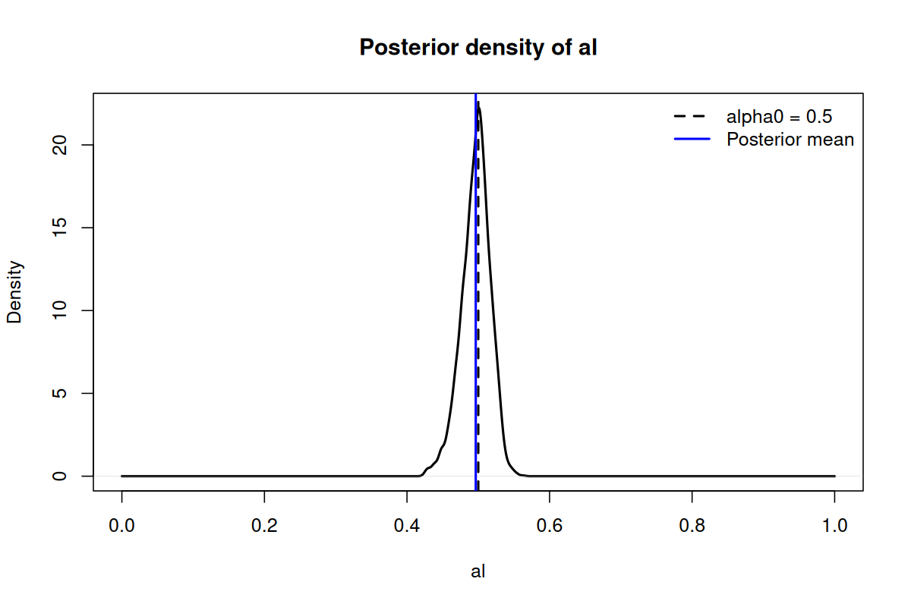

# BayesRegulationInference

`BayesRegulationInference` is an R package for Bayesian MCMC inference on lineage-level time series using a compiled C++ backend.

The package provides `bayesian_mcmc()`, which takes a numeric matrix of observations and returns posterior samples, summary statistics, and acceptance diagnostics.

## Installation from GitHub

Install the package directly from GitHub with `remotes`:

```r
install.packages("remotes")
remotes::install_github("mishashe/Bayes_Regulation_Inference")
```

If you prefer `devtools`, you can use:

```r
install.packages("devtools")
devtools::install_github("mishashe/Bayes_Regulation_Inference")
```

Because the package compiles C++ code, you need a working R build toolchain:

- On Linux: `g++`, `make`, and R development tools.
- On macOS: Xcode Command Line Tools.
- On Windows: Rtools matching your R version.

## Load the package

```r
library(BayesRegulationInference)
```

## Data format

`bayesian_mcmc()` expects a numeric matrix:

- Rows are lineages.
- Columns are time points.
- `NA` and `NaN` values are ignored.
- By default, zeros are treated as padding and ignored.

This default is useful when lineages have different observed lengths and shorter lineages are padded with zeros to fit a rectangular matrix.

If zero is a real measurement in your data, set `zeroIsPadding = FALSE`.

## Bundled example input file

The package includes a bundled CSV file, `cell_size_simulation.csv`, under `extdata`.

You can load it after installation with:

```r
csv_path <- system.file(
  "extdata",
  "cell_size_simulation.csv",
  package = "BayesRegulationInference"
)

vM <- as.matrix(read.csv(csv_path, header = FALSE))
```

## Full Example with Output Plot

The package ships with an installed example script at `inst/examples/example.R`.

After installation, you can locate and run it with:

```r
example_path <- system.file(
  "examples",
  "example.R",
  package = "BayesRegulationInference"
)

source(example_path)
```

The script:

- loads `cell_size_simulation.csv`
- runs `bayesian_mcmc()` with `1e7` iterations
- prints posterior summaries
- computes a Bayes factor example for `al`
- writes the alpha posterior plot to an `example_output/` directory

The generated files are:

- `alpha_density_kde.png`
- `posterior_summary.csv`

Core example code:

```r
library(BayesRegulationInference)

csv_path <- system.file(
  "extdata",
  "cell_size_simulation.csv",
  package = "BayesRegulationInference"
)

vM <- as.matrix(read.csv(csv_path, header = FALSE))

out <- bayesian_mcmc(
  vM = vM,
  nIter = 1e7,
  burnin = 7e6,
  thin = 1000,
  seed = 1,
  verbose = FALSE
)

bf_alpha_05 <- bayes_factor_alpha_point_vs_uniform01(
  out,
  alpha0 = 0.5,
  method = "kde"
)
```

This `1e7`-iteration example took about 760 seconds, or roughly 12 minutes 40 seconds, on this machine.

Example output plot:



Expected console output from the long example run:

```text
Posterior summaries (mean +/- half-width of 95% CrI)
---------------------------------------------------
sig_xi   : 0.1952 +/- 0.0094   (95% CrI: [0.1835, 0.2024])
al       : 0.4965 +/- 0.0403   (95% CrI: [0.4513, 0.5318])
mu0      : 2.0151 +/- 0.0150   (95% CrI: [2.0000, 2.0301])
sig0     : 0.0387 +/- 0.0187   (95% CrI: [0.0198, 0.0572])
sig_meas : 0.0317 +/- 0.0336   (95% CrI: [0.0025, 0.0696])

Bayes factor for al = 0.5 versus Uniform(0,1)
---------------------------------------------
BF12   : 22.1478
logBF12: 3.0977
```

## Minimal Example

```r
library(BayesRegulationInference)

vM <- matrix(
  c(
    1.10, 1.30, 1.50, 0.00,
    0.95, 1.05, 1.20, 1.35,
    1.80, 2.00, 0.00, 0.00
  ),
  nrow = 3,
  byrow = TRUE
)

fit <- bayesian_mcmc(
  vM,
  nIter = 2000,
  burnin = 1000,
  thin = 10,
  seed = 123,
  verbose = FALSE
)
```

## Inspect the Results

The returned object is a list. Common components include:

- `samples`: posterior draws matrix.
- `logPost`: log-posterior value for each retained draw.
- `mean`: posterior mean for each parameter.
- `median`: posterior median for each parameter.
- `std`: posterior standard deviation for each parameter.
- `names`: parameter names matching the columns of `samples`.
- `acceptRateOverall`: overall Metropolis acceptance rate.
- `acceptRatePerParam`: per-parameter acceptance diagnostics.
- `finalSteps`: final proposal step sizes.
- `lb`, `ub`, `par0`: bounds and initial values used by the sampler.

Example:

```r
fit$names
fit$mean
fit$std
fit$acceptRateOverall

head(fit$samples)
```

Using the bundled CSV:

```r
csv_path <- system.file(
  "extdata",
  "cell_size_simulation.csv",
  package = "BayesRegulationInference"
)

vM <- as.matrix(read.csv(csv_path, header = FALSE))

fit <- bayesian_mcmc(
  vM,
  nIter = 2000,
  burnin = 1000,
  thin = 10,
  verbose = FALSE
)
```

## Parameter Layout

The parameter vector is ordered as:

- `mu_1`, `mu_2`, ..., `mu_N`: lineage-specific mean parameters.
- `sig_xi`: process noise scale.
- `al`: autoregressive update parameter.
- `mu0`: global mean across lineages.
- `sig0`: across-lineage standard deviation.
- `sig_meas`: measurement noise scale.

## Customize the Sampler

You can override defaults when needed:

```r
fit <- bayesian_mcmc(
  vM,
  nIter = 10000,
  burnin = 5000,
  thin = 20,
  adaptEvery = 100,
  targetAccept = 0.30,
  zeroIsPadding = TRUE,
  verbose = TRUE,
  printEvery = 1000
)
```

Advanced arguments:

- `steps_`: scalar or full parameter vector of proposal step sizes.
- `lb_`: custom lower bounds.
- `ub_`: custom upper bounds.
- `par0_`: custom initial parameter values.

The expected length of `lb_`, `ub_`, and `par0_` is `nrow(vM) + 5`.

## Bayes Factor for `alpha`

The package also provides `bayes_factor_alpha_point_vs_uniform01()` for a Savage-Dickey style Bayes factor on the `al` parameter.

It compares:

- `H1`: `al = alpha0`
- `H2`: `al ~ Uniform(0, 1)`

The function uses posterior samples from `fit$samples` and estimates the posterior density at `alpha0`. Since the prior under `H2` is Uniform(0,1), the prior density is 1, so the Bayes factor is the posterior density estimate at that point.

Example:

```r
bf <- bayes_factor_alpha_point_vs_uniform01(
  fit,
  alpha0 = 0.5,
  method = "kde"
)

bf$BF12
bf$logBF12
```

You can also use a simple local bin estimate instead of kernel density estimation:

```r
bf_bin <- bayes_factor_alpha_point_vs_uniform01(
  fit,
  alpha0 = 0.5,
  method = "bin",
  eps_bin = 1e-3
)
```

Interpretation:

- `BF12 > 1` supports the point null `al = alpha0`.
- `BF12 < 1` supports the Uniform(0,1) alternative.
- `logBF12` is the natural log of the Bayes factor.

## Install from a Local Clone

If you have already cloned the repository:

```r
install.packages("remotes")
remotes::install_local("Bayes_Regulation_Inference")
```

Or from a shell:

```sh
R CMD INSTALL Bayes_Regulation_Inference
```

## Help Inside R

After installation:

```r
?bayesian_mcmc
?bayes_factor_alpha_point_vs_uniform01
```
